# Relatório Técnico Completo de Análises
## Alagamentos Urbanos no Rio de Janeiro — Limiares de Precipitação com API
### Hanna Soares Viana | PPGM IGEO-UFRJ | 2015–2024

---

## Sumário

1. [Visão Geral do Projeto](#1-visão-geral-do-projeto)
2. [Caracterização dos Dados](#2-caracterização-dos-dados)
3. [Análise I-D por Estação (Metodologia 1)](#3-análise-i-d-por-estação-metodologia-1)
4. [Análise API Global (Metodologia 2)](#4-análise-api-global-metodologia-2)
5. [Análise API por Estação (Metodologia 3)](#5-análise-api-por-estação-metodologia-3)
6. [Análise API por Sub-bacia com K Fixo (Metodologia 4)](#6-análise-api-por-sub-bacia-com-k-fixo-metodologia-4)
7. [Análise Sazonal com K Fixo (Metodologia 5)](#7-análise-sazonal-com-k-fixo-metodologia-5)
8. [Análise API por Sub-bacia com K Otimizado (Metodologia 6)](#8-análise-api-por-sub-bacia-com-k-otimizado-metodologia-6)
9. [Análise Sazonal com K Otimizado (Metodologia 7)](#9-análise-sazonal-com-k-otimizado-metodologia-7)
10. [Comparação entre Metodologias](#10-comparação-entre-metodologias)
11. [Inventário de Gráficos e Arquivos](#11-inventário-de-gráficos-e-arquivos)

---

## 1. Visão Geral do Projeto

O projeto integra duas bases operacionais para estabelecer limiares de precipitação para sistemas de alerta de alagamentos no Rio de Janeiro:

- **Alerta Rio:** 33 estações pluviométricas com dados a cada 15 minutos (2015–2024)
- **COR-Rio:** 4.868 registros georreferenciados de alagamentos (bolsões d'água, alagamentos e lâminas d'água)

Foram desenvolvidas **seis metodologias progressivamente mais refinadas**. O eixo de evolução é:

```
Limiar I-D simples → API com K fixo (global) → API por estação
    → API por sub-bacia com K fixo → API por sub-bacia com K otimizado
    → API sazonal por sub-bacia
```

### 1.1 Dados de entrada consolidados

| Variável | Valor |
|----------|-------|
| Período de análise | jan/2015 – dez/2024 |
| Estações pluviométricas | 33 |
| Sub-bacias hidrográficas | 51 identificadas, 39 com ajuste |
| Total de registros COR-Rio | 87.620 |
| Registros de alagamento selecionados | 4.868 |
| Pares dia–sub-bacia processados | 21.799 |
| EA (dias com alagamento) | 1.706 |
| ESA (dias sem alagamento) | 20.093 |

---

## 2. Caracterização dos Dados

### 2.1 Tipos de ocorrência

86,6% dos registros são classificados como "Bolsão d'água em via" — acúmulos que impedem pedestres mas permitem veículos leves. Apenas 9,6% são "Alagamentos" (impedem veículos) e 3,8% "Lâminas d'água".

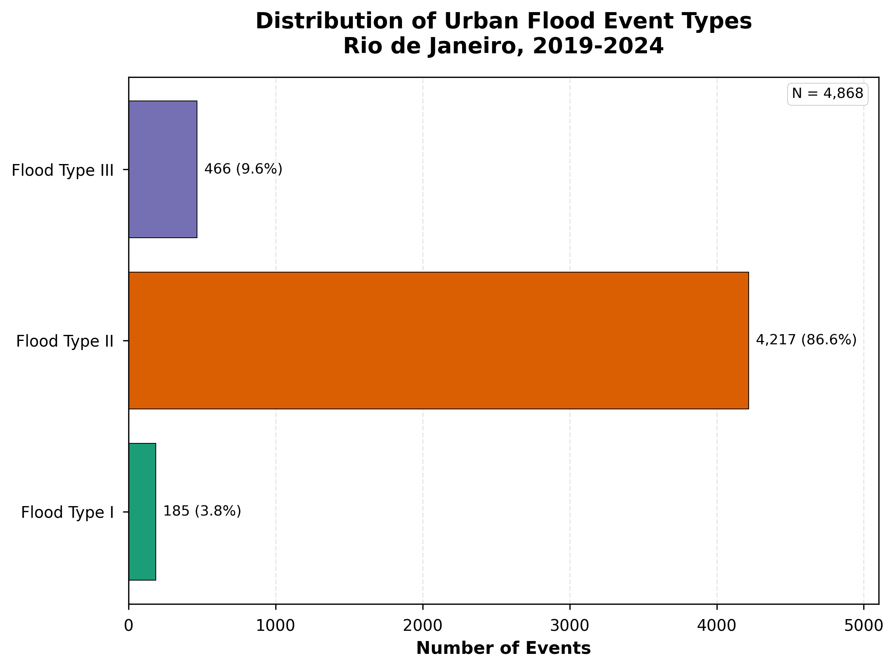

### 2.2 Distribuição temporal

O verão (DJF) concentra 47,9% de todos os eventos. O pico horário ocorre entre 18h e 20h, coincidindo com chuvas convectivas de tarde que se intensificam com o aquecimento diurno e a brisa marítima.

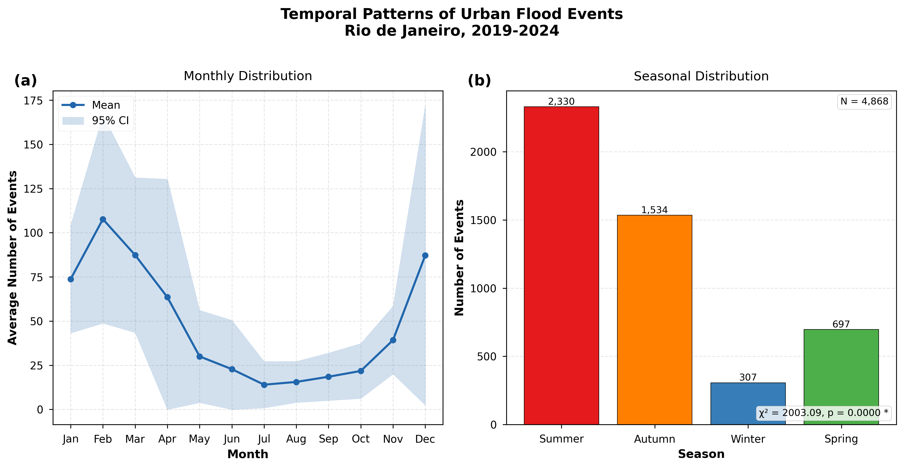

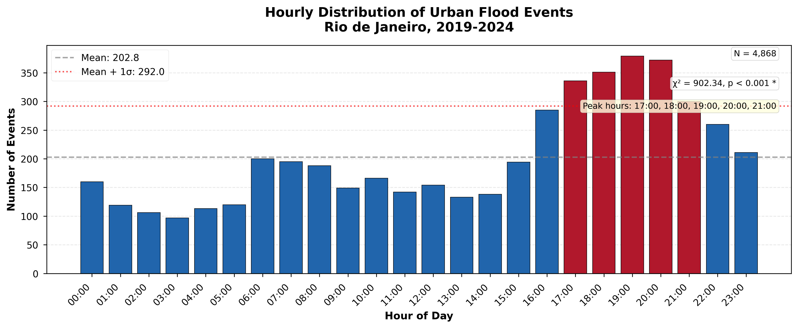

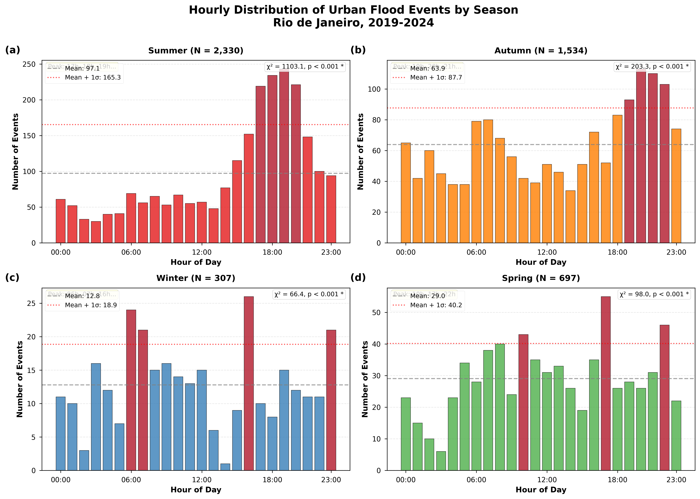

### 2.3 Duração dos alagamentos

47% dos eventos são resolvidos em até 2 horas (drenagem natural). A cauda longa (13% persistindo > 6 horas) aponta para efeitos de saturação do solo ou represamento por maré alta.

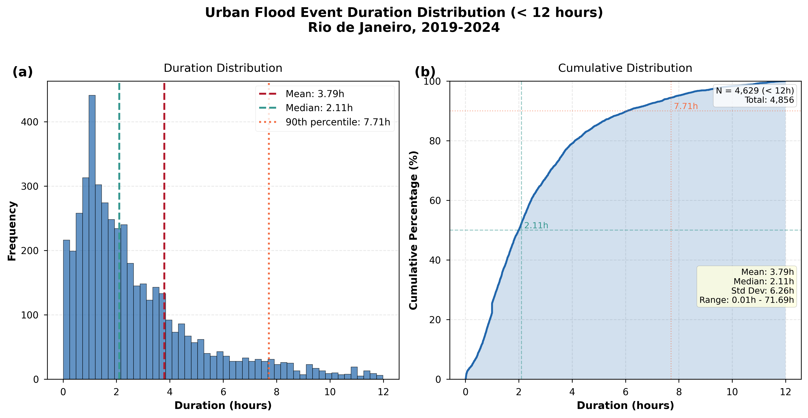

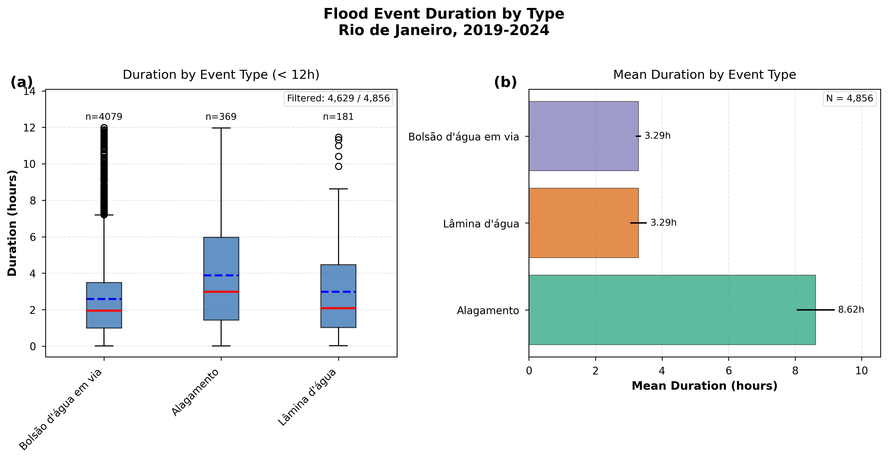

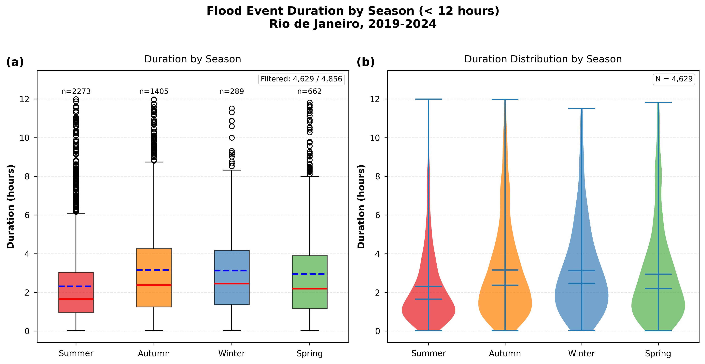

### 2.4 Cobertura espacial da rede

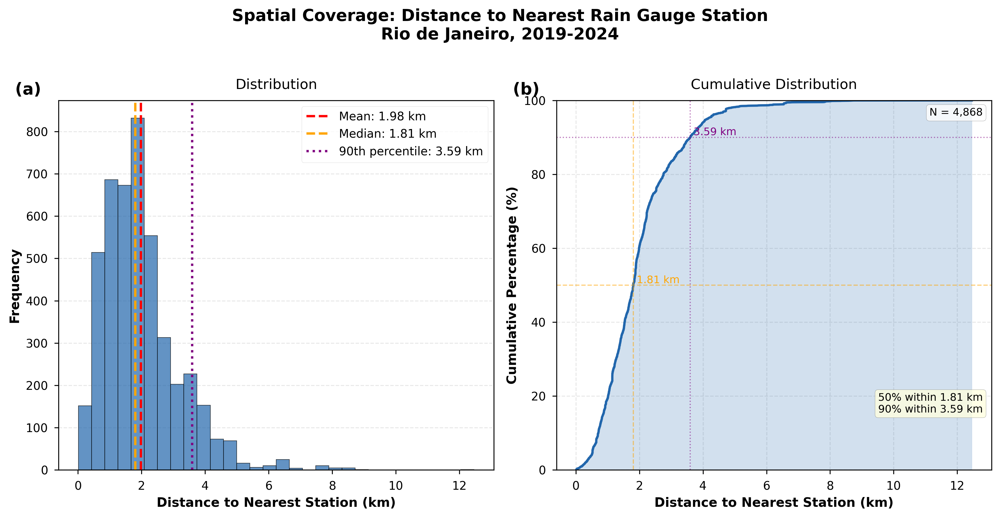

---

## 3. Análise I-D por Estação (Metodologia 1)

### 3.1 Descrição metodológica

Cada evento de chuva foi segmentado por período seco mínimo de 6 horas. Para cada evento calculou-se a intensidade máxima em janelas de 15 min a 12 horas. O limiar foi ajustado por **SVM linear em escala log-log** (I = a × D⁻ᵇ), com peso de classe 10:1 para EA:ESA para maximizar detecção.

**Total de pontos I-D gerados:** 63.776  
**Estações com ajuste bem-sucedido:** 9 de 33

### 3.2 Parâmetros ajustados

| Estação | a | b | Recall (POD) | Precision (PPV) | F1 | n EA | n ESA |
|---------|-----|------|-------------|----------------|-----|------|-------|
| 31 | 13,93 | 0,342 | 0,880 | 0,180 | 0,298 | 92 | 1.954 |
| 32 | 6,26 | 0,204 | 0,993 | 0,141 | 0,248 | 138 | 1.519 |
| 27 | 20,77 | 0,584 | 1,000 | 0,145 | 0,254 | 25 | 1.629 |
| 25 | 35,13 | 0,321 | 0,824 | 0,133 | 0,230 | 17 | 2.373 |
| 28 | 7,60 | 0,283 | 0,990 | 0,062 | 0,118 | 98 | 3.155 |
| 23 | 12,78 | 0,449 | 1,000 | 0,065 | 0,123 | 28 | 1.638 |
| 24 | 7,12 | 0,338 | 1,000 | 0,069 | 0,129 | 66 | 1.806 |
| 10 | 8,20 | 0,213 | 1,000 | 0,035 | 0,067 | 26 | 1.660 |
| 22 | 18,39 | 0,291 | 0,826 | 0,054 | 0,101 | 23 | 1.814 |
| **Média** | — | — | **0,935** | **0,107** | **0,174** | — | — |

**Parâmetro a:** intercepto — intensidade de referência na duração unitária (1h). Varia de 6,26 (Est. 32, área densa, limiar baixo) a 35,13 (Est. 25, área menos vulnerável).  
**Parâmetro b:** declividade em log-log — quanto maior, mais a intensidade crítica cai com a duração. Est. 27 (b = 0,584) tem o limiar que mais depende da duração curta.

### 3.3 Exemplos de gráficos

**Scatter I-D — Estação 31 (melhor F1):**

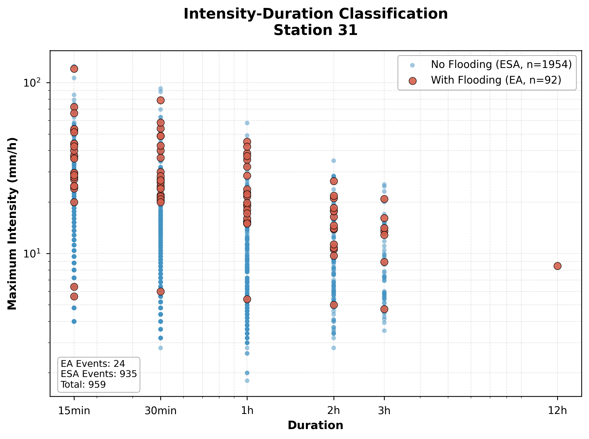

**Curva de limiar ajustada — Estação 31:**

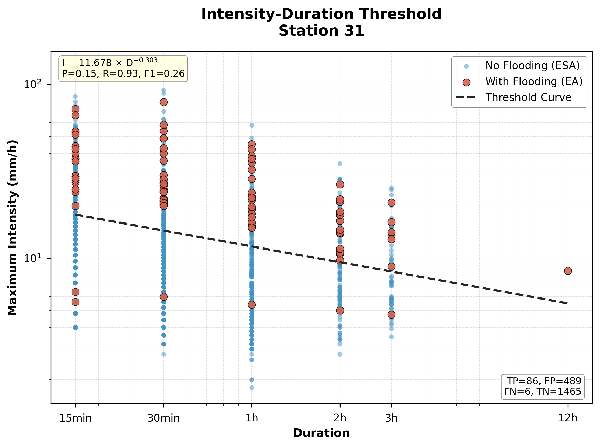

**Estação 32 (maior n de EA — 138 eventos):**

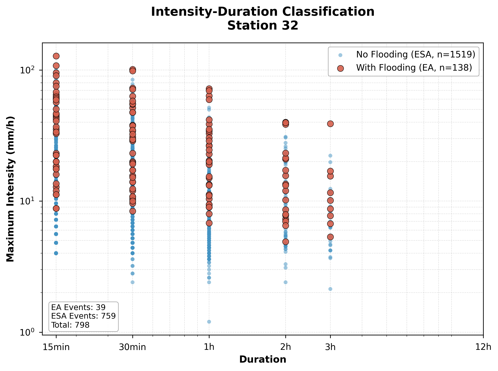

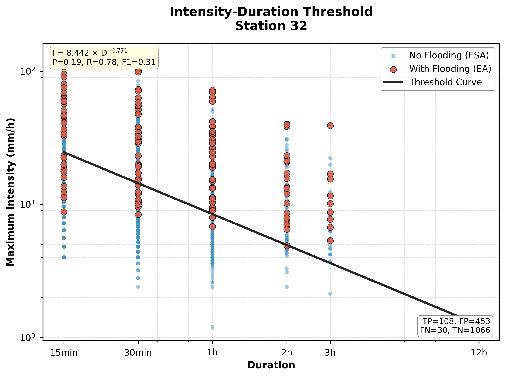

### 3.4 Limitações

- Apenas 9/33 estações com EA suficiente — dependência da densidade de registros COR-Rio
- O limiar I = a × D⁻ᵇ não considera o estado de saturação do solo
- Alta recall mas baixa precision (F1 médio = 0,174) por desbalanceamento severo

---

## 4. Análise API Global (Metodologia 2)

### 4.1 Descrição metodológica

O Índice de Precipitação Antecedente (API) acumula a chuva dos dias anteriores com decaimento exponencial:

```
API_n(t) = Σ K^i × P(t−i)    i = 1..n,  K = 0,85
```

Para cada dia com precipitação foram calculadas as intensidades de pico em **10 escalas temporais** (15 min a 24 h). A zona intermediária entre limiar superior (percentil 99 das ESA) e inferior (percentil 5 das EA) foi modelada pela curva:

```
I = a · e^(b · API) + c
```

Ajustada por busca em grade: **50 × 20 × 50 = 50.000 combinações** de (a, b, c).  
**Score = POD × PPV × (1 − FAR)**

### 4.2 Parâmetros por time-step

| Duração | POD (lower_tol) | FAR (lower_tol) | Melhor janela | a | b | c | POD_api | FAR_api |
|---------|----------------|----------------|--------------|---|---|---|---------|---------|
| 15 min | 0,946 | 0,645 | 8 dias | 25,08 | −0,375 | 39,20 | 0,496 | 0,151 |
| 30 min | 0,946 | 0,646 | 1 dia | 39,43 | −0,531 | 29,88 | 0,333 | 0,071 |
| 1 h | 0,961 | 0,708 | 1 dia | 4,04 | −0,166 | 21,12 | 0,488 | 0,127 |
| 2 h | 0,946 | 0,770 | 9 dias | 4,83 | −0,062 | 10,44 | 0,614 | 0,174 |
| 3 h | 0,946 | 0,771 | 1 dia | 3,64 | −0,062 | 8,30 | 0,527 | 0,129 |
| 6 h | 0,946 | 0,790 | 10 dias | 2,11 | −0,166 | 6,53 | 0,488 | 0,105 |
| 8 h | 0,946 | 0,803 | 8 dias | 2,53 | −0,375 | 4,73 | 0,512 | 0,120 |
| 10 h | 0,946 | 0,813 | 10 dias | 2,68 | −0,062 | 3,34 | 0,528 | 0,129 |
| 12 h | 0,946 | 0,823 | 10 dias | 2,31 | −0,062 | 2,78 | 0,528 | 0,134 |
| 24 h | 0,946 | 0,849 | 10 dias | 1,07 | −0,114 | 1,66 | 0,512 | 0,144 |

> O POD do limiar inferior é uniformemente 0,946 porque os dados globais têm muitos EA — o limiar fica tão baixo que captura quase todos. A FAR cresce com a duração (limiares de longa duração são mais fáceis de ultrapassar). A curva exponencial (POD_api) reduz FAR para < 0,17 mas sacrifica POD para 0,33–0,61.

### 4.3 Gráficos

**Limiares I-D com tolerância — escala global:**

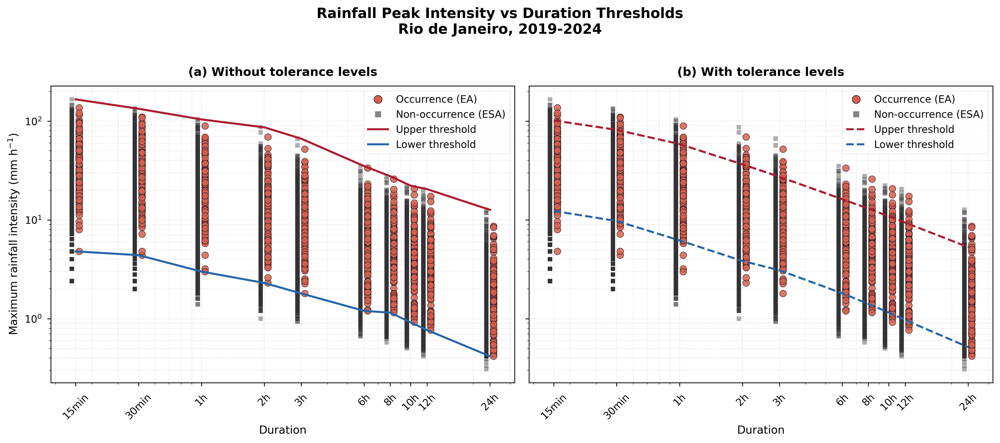

**Zonas de alerta API — escala global:**

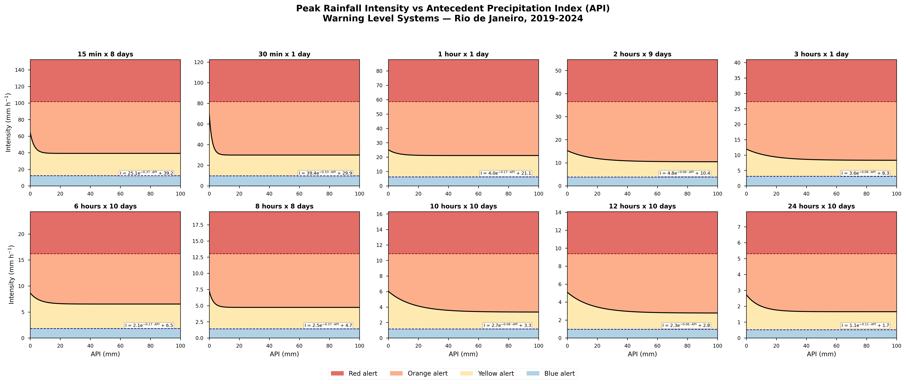

---

## 5. Análise API por Estação (Metodologia 3)

### 5.1 Descrição

Mesma metodologia da seção 4 aplicada individualmente às 33 estações. Captura a variabilidade local — estações em áreas densas têm limiares distintos das estações em fundos de vale ou próximas a canais.

**Estações com parâmetros ajustados:** 22 de 33  
**Combinações (estação × time-step):** 330 linhas

### 5.2 Resultados por estação

| Estação | POD (lower) | FAR (lower) | Dias ant. médio | POD_api | FAR_api |
|---------|------------|------------|----------------|---------|---------|
| 27 | 0,750 | **0,098** | 4,2 | **0,650** | **0,028** |
| 31 | **0,941** | 0,413 | 7,5 | **0,701** | 0,106 |
| 19 | 0,775 | 0,334 | 2,4 | 0,450 | 0,051 |
| 7 | 0,875 | 0,503 | 2,7 | 0,563 | 0,047 |
| 22 | 0,833 | 0,465 | 3,4 | 0,617 | 0,064 |
| 25 | 0,833 | 0,429 | 4,8 | 0,600 | 0,028 |
| 28 | 0,889 | 0,657 | **9,4** | **0,744** | 0,139 |
| 13 | 0,900 | 0,614 | 5,2 | 0,511 | 0,118 |
| 11 | 0,923 | 0,818 | 2,7 | 0,485 | 0,174 |
| 18 | 0,929 | 0,799 | 4,2 | 0,464 | 0,073 |
| 24 | **0,945** | 0,779 | 3,4 | 0,358 | 0,064 |
| **Média (22)** | **0,794** | **0,596** | — | — | — |

**Destaque:** Estação 27 combina a menor FAR do projeto (0,098) com POD de 0,750 — relação 1:10 entre falsos alarmes e acertos, o melhor balanço individual encontrado. Estação 28 tem a maior janela antecedente média (9,4 dias) — maior dependência de precipitação acumulada.

### 5.3 Gráficos

**Zonas de alerta API — Estação 31:**

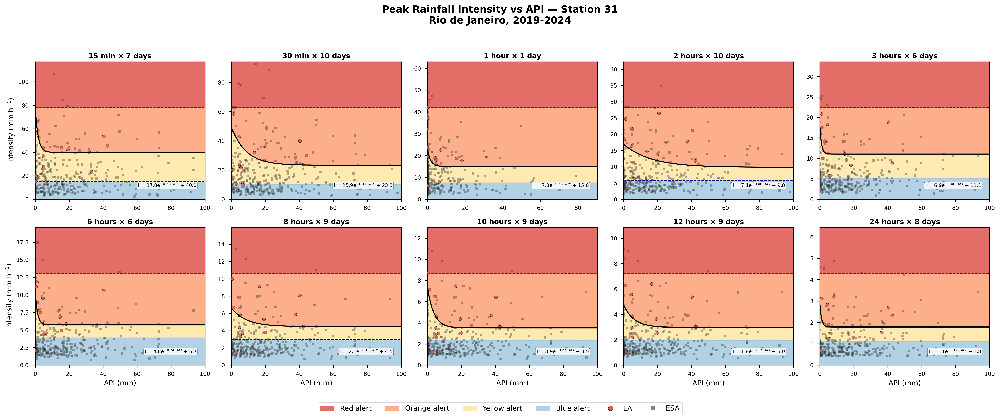

**Limiares I-D com API — Estação 31:**

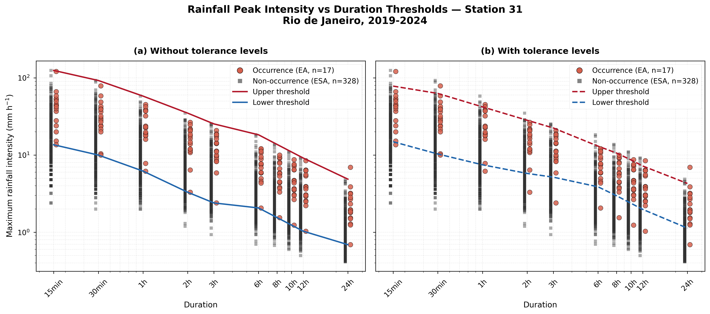

**Estação 28 (maior janela antecedente — 9,4 dias):**

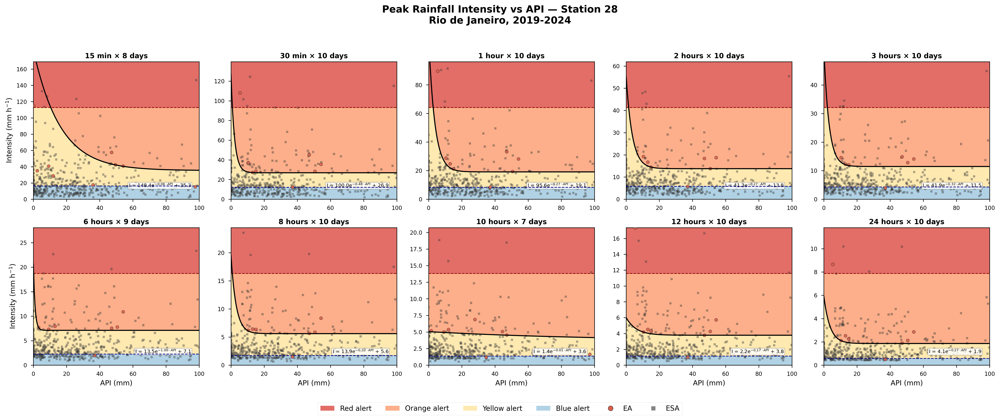

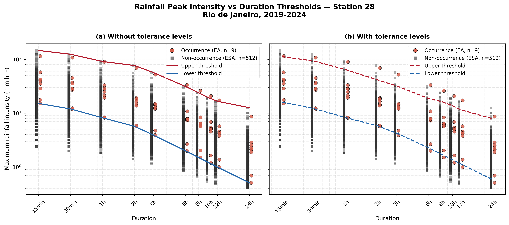

---

## 6. Análise API por Sub-bacia com K Fixo (Metodologia 4)

### 6.1 Descrição metodológica

Esta análise representa a primeira extensão da abordagem API para o nível de sub-bacia hidrográfica, disponível no branch `main` do projeto. A precipitação é agregada pela ponderação da área de interseção entre os Polígonos de Thiessen e as sub-bacias (149 pares estação–sub-bacia), e o API é calculado com **K = 0,85 fixo** para janelas de 1 a 10 dias — o mesmo valor adotado por Ramos Filho et al. (2021). Para cada sub-bacia e duração, a busca em grade testa **10 combinações** (1 K × 10 janelas antecedentes).

**Parâmetros ajustados:** upper_tol, lower_tol, a, b, c e best_antecedent_days.  
**K fixo em 0,85** — sem variação entre sub-bacias.

### 6.2 Cobertura

| Variável | Valor |
|----------|-------|
| Sub-bacias com parâmetros ajustados | 39 de 51 |
| Combinações (sub-bacia × time-step) | 390 linhas válidas |
| Distribuição de best_antecedent_days | 1 dia: 48% · 10 dias: 12% · 2–9 dias: 40% |

**Distribuição do dia antecedente ótimo:**

| Dias | Ocorrências | % |
|------|-------------|---|
| 1 | 187 | 47,9% |
| 10 | 45 | 11,5% |
| 3 | 37 | 9,5% |
| 7 | 23 | 5,9% |
| 2 | 18 | 4,6% |
| 8 | 19 | 4,9% |
| 9 | 19 | 4,9% |
| 4 | 13 | 3,3% |
| 5 | 11 | 2,8% |
| 6 | 8 | 2,1% |
| 0 | 10 | 2,6% |

### 6.3 Resultados por sub-bacia (K = 0,85 fixo) — Metodologia 4

| # | Sub-bacia | POD | FAR | PPV | Score | Dias médio | Dias modal | a médio | b médio |
|---|-----------|-----|-----|-----|-------|-----------|-----------|---------|---------|
| 1 | Canal do Mangue (51) | 0,945 | 0,728 | 0,283 | 0,0729 | 5,1 | 1 | 9,71 | −0,291 |
| 2 | Micro Bacia do Centro (50) | 0,950 | 0,789 | 0,332 | 0,0667 | 6,1 | 1 | 9,01 | −0,244 |
| 3 | Canal do Cunha (49) | 0,947 | 0,857 | 0,271 | 0,0368 | 6,2 | 10 | 26,29 | −0,239 |
| 4 | Copacabana (36) | 0,944 | 0,686 | 0,123 | 0,0366 | 4,7 | 1 | 4,52 | −0,140 |
| 5 | Urca (54) | 0,875 | 0,350 | 0,056 | 0,0317 | 1,0 | 1 | 43,27 | −0,015 |
| 6 | Rio Sarapuí (47) | 0,947 | 0,560 | 0,070 | 0,0290 | 1,2 | 1 | 24,03 | −0,583 |
| 7 | Restinga da Barra (37) | 0,950 | 0,902 | 0,288 | 0,0268 | 1,0 | 1 | 36,27 | −0,640 |
| 8 | Lagoa Rodrigo de Freitas (33) | 0,945 | 0,872 | 0,212 | 0,0257 | 1,0 | 1 | 12,62 | −0,458 |
| 9 | Acari/Pavuna/Meriti (45) | 0,950 | 0,911 | 0,289 | 0,0245 | 8,4 | 10 | 10,57 | −0,109 |
| 10 | Arroio Fundo/Rio Grande (26) | 0,941 | 0,839 | 0,162 | 0,0244 | 4,9 | 1 | 6,81 | −0,286 |
| 11 | Cocotá/Pitangueiras (12) | 0,833 | 0,400 | 0,043 | 0,0213 | 1,3 | 1 | 12,50 | −0,234 |
| 12 | Rio Carioca (52) | 0,941 | 0,759 | 0,088 | 0,0200 | 3,9 | 1 | 10,82 | −0,271 |
| 13 | Rio das Pedras (35) | 0,932 | 0,792 | 0,100 | 0,0194 | 1,0 | 1 | 40,94 | −0,390 |
| 14 | Canal dos Bancários (8) | 0,938 | 0,718 | 0,070 | 0,0185 | 3,9 | 3 | 43,60 | −0,203 |
| 15 | Rio Ramos (48) | 0,946 | 0,785 | 0,087 | 0,0177 | 7,8 | 7 | 28,10 | −0,062 |
| 16 | Rio Guerenguê (28) | 0,900 | 0,577 | 0,041 | 0,0154 | 2,2 | 1 | 34,67 | −0,119 |
| 17 | Prata do Mendanha (18) | 0,947 | 0,749 | 0,052 | 0,0124 | 4,8 | 4 | 19,01 | −0,380 |
| 18 | Praia de São Bento (14) | 0,952 | 0,841 | 0,081 | 0,0122 | 3,7 | 3 | 44,38 | −0,614 |
| 19 | Rio Jequiá (13) | 0,921 | 0,855 | 0,088 | 0,0117 | 5,2 | 3 | 39,53 | −0,172 |
| 20 | Botafogo (53) | 0,941 | 0,910 | 0,133 | 0,0113 | 2,2 | 1 | 29,31 | −0,271 |
| 21 | Galeão (9) | 0,875 | 0,587 | 0,031 | 0,0111 | 5,9 | 5 | 39,26 | −0,099 |
| 22 | Rio Irajá/Canal da Penha (46) | 0,943 | 0,860 | 0,069 | 0,0091 | 3,1 | 1 | 17,98 | −0,052 |
| 23 | Rio da Cachoeira (30) | 0,948 | 0,921 | 0,115 | 0,0086 | 1,7 | 1 | 26,06 | −0,364 |
| 24 | São Conrado (39) | 0,947 | 0,923 | 0,115 | 0,0084 | 8,4 | 9 | 43,05 | −0,151 |
| 25 | Rio Piraquê/Cabuçu (21) | 0,952 | 0,805 | 0,044 | 0,0082 | 7,1 | 4 | 34,87 | −0,020 |
| 26 | Rio do Ponto (22) | 0,917 | 0,846 | 0,055 | 0,0078 | 4,5 | 3 | 5,84 | −0,385 |
| 27 | Praia da Guanabara (10) | 0,923 | 0,831 | 0,049 | 0,0077 | 9,3 | 10 | 31,61 | −0,093 |
| 28 | Zona dos Canais (29) | 0,941 | 0,806 | 0,038 | 0,0069 | 1,0 | 1 | 55,73 | −0,156 |
| 29 | Rio Campinho (19) | 0,933 | 0,903 | 0,061 | 0,0055 | 3,0 | 1 | 13,48 | −0,057 |
| 30 | Jardim Guanabara (15) | 0,833 | 0,724 | 0,024 | 0,0054 | 1,0 | 1 | 29,25 | −0,536 |
| 31 | Rio dos Passarinhos (31) | 0,927 | 0,842 | 0,033 | 0,0049 | 1,0 | 1 | 37,46 | −0,531 |
| 32 | Rio da Barra (41) | 0,750 | 0,626 | 0,017 | 0,0048 | 2,0 | 1 | 27,58 | −0,411 |
| 33 | Rio do Anil (27) | 0,900 | 0,780 | 0,023 | 0,0046 | 1,0 | 1 | 32,31 | −0,177 |
| 34 | Vidigal (40) | 0,500 | 0,253 | 0,011 | 0,0041 | 0,0 | 0 | — | — |
| 35 | Ilha do Fundão (17) | 0,667 | 0,502 | 0,009 | 0,0031 | 5,8 | 10 | 7,33 | −0,052 |
| 36 | Canal da Portuguesa (11) | 0,857 | 0,851 | 0,024 | 0,0031 | 3,6 | 1 | 19,82 | −0,453 |
| 37 | Rio Cação Vermelho (20) | 0,927 | 0,942 | 0,052 | 0,0028 | 5,1 | 1 | 19,65 | −0,161 |
| 38 | Rio Muzema (38) | 0,857 | 0,882 | 0,024 | 0,0024 | 1,6 | 1 | 22,92 | −0,609 |
| 39 | Rio Camorim/Caçambê (32) | 0,667 | 0,755 | 0,007 | 0,0012 | 1,6 | 1 | 27,12 | −0,140 |
| **Média** | — | **0,895** | **0,757** | **0,094** | **0,0205** | — | — | — | — |

### 6.4 Interpretação dos parâmetros (K = 0,85 fixo)

| Parâmetro | Significado | Faixa observada |
|-----------|-------------|----------------|
| **a** | Amplitude — intensidade de referência quando API = 0 | 4,52 (Copacabana) a 55,73 (Zona dos Canais) |
| **b** | Sensibilidade ao API — quão rapidamente o limiar cai com a saturação | −0,015 (Urca) a −0,640 (Restinga da Barra) |
| **c** | Deslocamento vertical — intensidade mínima independente da API | 0,91 (Passarinhos) a 14,87 (Cocotá) |
| **Dias ant.** | Janela de API que maximiza o score | 1 dia (48%) domina; 10 dias segundo (12%) |

> **Canal do Mangue** e **Micro Bacia do Centro** lideram em score com K = 0,85 fixo, mas ambas melhoram ainda mais com K otimizado (ver seção 7). A **Urca** destaca-se pela menor FAR (0,350) com b = −0,015 — limiar praticamente insensível à API, dominado pelo evento imediato.

### 6.5 Gráficos — Canal do Mangue com K = 0,85

**Zonas de alerta API (K = 0,85 fixo):**

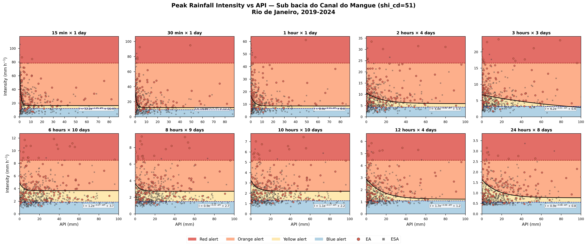

**Limiares I-D (K = 0,85 fixo):**

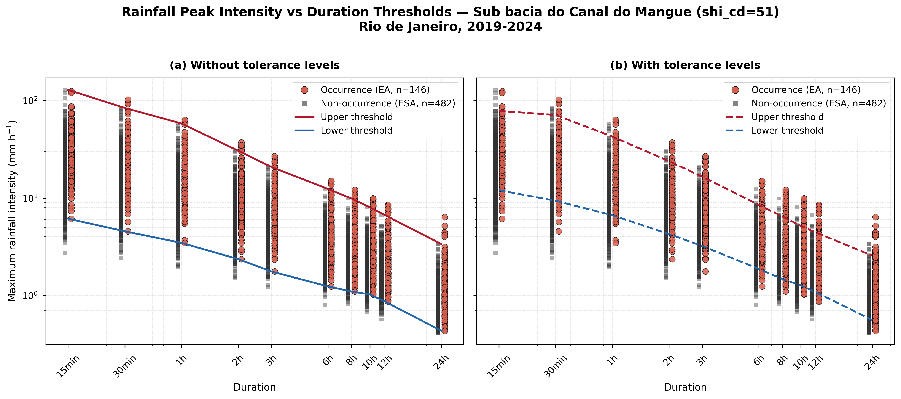

**Micro Bacia do Centro (maior score absoluto com K = 0,85):**

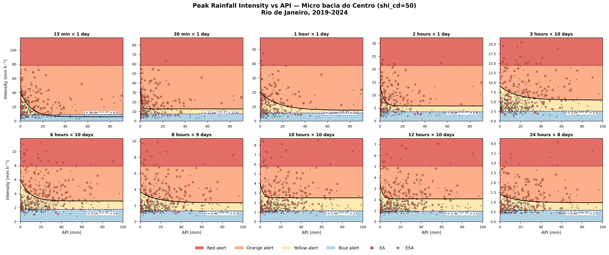

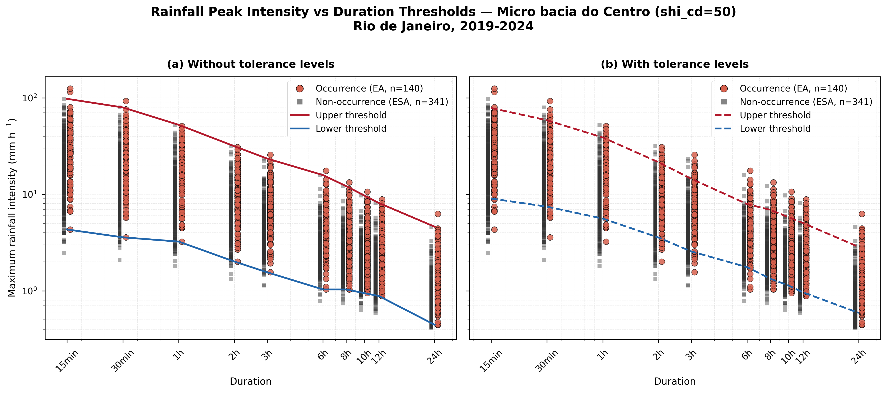

**Sub-bacia dos Rios Acari/Pavuna/Meriti (maior janela antecedente modal — 10 dias):**

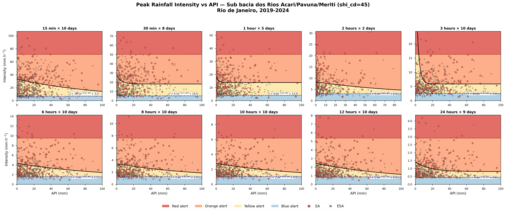

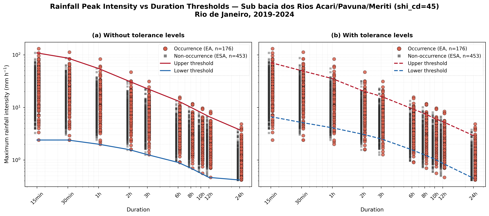

---

## 7. Análise Sazonal com K Fixo (Metodologia 5)

### 7.1 Descrição metodológica

Aplicação da separação sazonal (Verão DJF, Outono MAM, Inverno JJA, Primavera SON) usando **K = 0,85 fixo**, sem grid search do coeficiente de decaimento. A busca otimiza apenas a janela antecedente (1 a 10 dias). É o par direto da Metodologia 4 (K fixo anual), transposta para o domínio sazonal, e serve como linha de base para comparação com a Metodologia 6 (K otimizado sazonal).

**Script:** `scripts/processing/fit_api_thresholds_per_subbacia_seasonal_fixed_k.py`  
**Outputs:** `api_threshold_parameters_seasonal_fixed_k.csv` (2.040 linhas) · `api_threshold_metrics_seasonal_fixed_k.csv`

### 7.2 Desempenho por estação

| Estação | n ajustados | POD | FAR | PPV | Score | Dias ant. médio | Dias = 1 |
|---------|------------|-----|-----|-----|-------|----------------|---------|
| Verão (DJF) | 350 | 0,880 | 0,748 | 0,137 | 0,030 | 3,9 dias | 46% |
| Outono (MAM) | 300 | 0,863 | 0,763 | 0,146 | 0,030 | 4,2 dias | 29% |
| **Inverno (JJA)** | **130** | **0,812** | **0,658** | **0,122** | **0,034** | **1,8 dias** | **69%** |
| Primavera (SON) | 220 | 0,822 | 0,745 | 0,099 | 0,021 | 1,9 dias | 66% |
| **Anual K fixo (ref.)** | **390** | **0,895** | **0,757** | — | — | — | — |

> Os valores de POD e FAR do limiar inferior são **idênticos** aos da análise com K otimizado sazonal. Isso ocorre porque os limiares upper_tol e lower_tol são percentis das intensidades de pico — não dependem do valor de K. O K afeta apenas a curva exponencial intermediária (parâmetros a, b, c) e, consequentemente, a zona de alerta amarela/laranja.

### 7.3 Limiares lower_tol por estação e duração (mm/h)

Idênticos à análise sazonal com K otimizado (ver tabela na seção 8):

| Duração | Verão | Outono | Inverno | Primavera |
|---------|-------|--------|---------|-----------|
| 15 min | 13,97 | 11,91 | 9,44 | 7,46 |
| 30 min | 11,27 | 9,14 | 7,35 | 6,22 |
| 1 h | 7,72 | 6,36 | 5,42 | 4,96 |
| 2 h | 4,91 | 4,19 | 3,60 | 3,54 |
| 3 h | 3,70 | 3,20 | 2,92 | 2,73 |
| 6 h | 2,15 | 1,94 | 1,76 | 1,77 |
| 24 h | 0,63 | 0,64 | 0,59 | 0,55 |

### 7.4 Diferença real entre K fixo e K otimizado: a curva intermediária

A única distinção entre as duas análises sazonais está nos parâmetros a, b, c da curva exponencial I = a·e^(b·API) + c e nos indicadores POD_api / FAR_api da zona intermediária:

| Estação | K | a médio | b médio | c médio | POD_api | FAR_api |
|---------|---|---------|---------|---------|---------|---------|
| **Verão** | Fixo 0,85 | 28,16 | −0,249 | 8,07 | 0,524 | 0,165 |
| | Otimizado | 30,11 | −0,288 | 7,52 | 0,516 | 0,157 |
| **Outono** | Fixo 0,85 | 26,07 | −0,265 | 6,49 | 0,512 | 0,131 |
| | Otimizado | 25,18 | −0,272 | 5,60 | 0,511 | 0,132 |
| **Inverno** | Fixo 0,85 | 10,48 | −0,307 | 5,18 | 0,507 | 0,087 |
| | Otimizado | 10,54 | −0,365 | 5,02 | 0,511 | 0,086 |
| **Primavera** | Fixo 0,85 | 15,27 | −0,367 | 5,09 | 0,496 | 0,128 |
| | Otimizado | 16,56 | −0,419 | 4,93 | 0,501 | 0,126 |

**Interpretação:**
- As diferenças são pequenas em todas as estações — K fixo e K otimizado convergem para parâmetros de curva similares quando o K não tem forte influência sazonal
- No inverno, o K otimizado produz **b mais negativo** (−0,365 vs −0,307), indicando que a curva é mais sensível à API quando K é livre para ajustar — mesmo que a maioria dos casos de inverno prefira K = 0,60 (drenagem rápida, API baixa), as sub-bacias que retêm memória têm curvas mais inclinadas
- O ganho de FAR_api no inverno é marginal (0,087 vs 0,086) — a vantagem do K otimizado sazonal sobre o K fixo sazonal é principalmente de interpretação física, não de desempenho operacional nos limiares

### 7.5 Janela antecedente ótima por estação

| Estação | K fixo (dias médio) | K otim. (dias médio) | Diferença |
|---------|--------------------|--------------------|-----------|
| Verão | 3,9 | 3,9 | 0,0 |
| Outono | 4,2 | 4,3 | +0,1 |
| Inverno | 1,8 | 1,8 | 0,0 |
| Primavera | 1,9 | 2,2 | +0,3 |

> A janela antecedente ótima é praticamente idêntica entre as duas versões — reforça que a escolha de K não altera a memória temporal identificada pela análise.

### 7.6 Gráficos

**Resumo sazonal K fixo — métricas, limiares e distribuição de dias antecedentes por estação:**

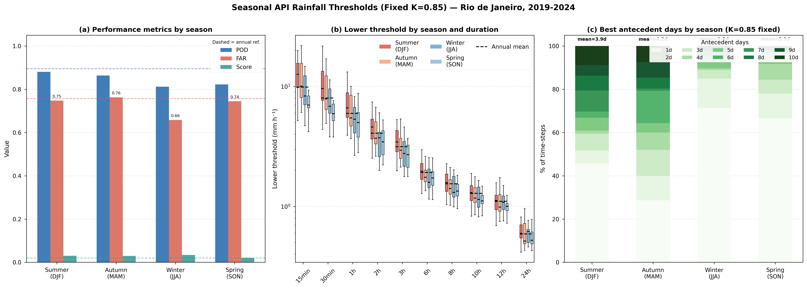

---

#### Micro Bacia do Centro (050) — Melhor score balanceado

**Visão geral: todos os eventos vs. limiares sazonais (api_5d, K=0,85):**

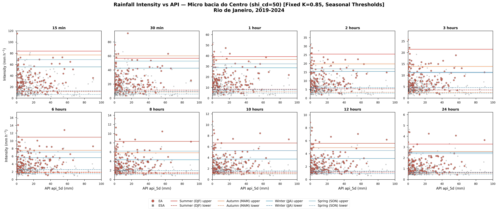

**Limiares I-D por estação (4 painéis):**

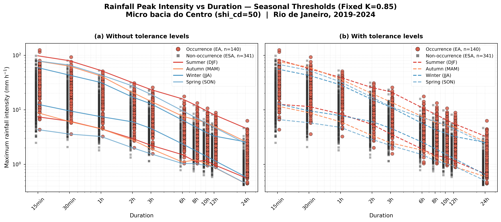

**Limiares I-D detalhados por estação:**


**Zonas de alerta sazonais (grade 10 durações × 4 estações):**

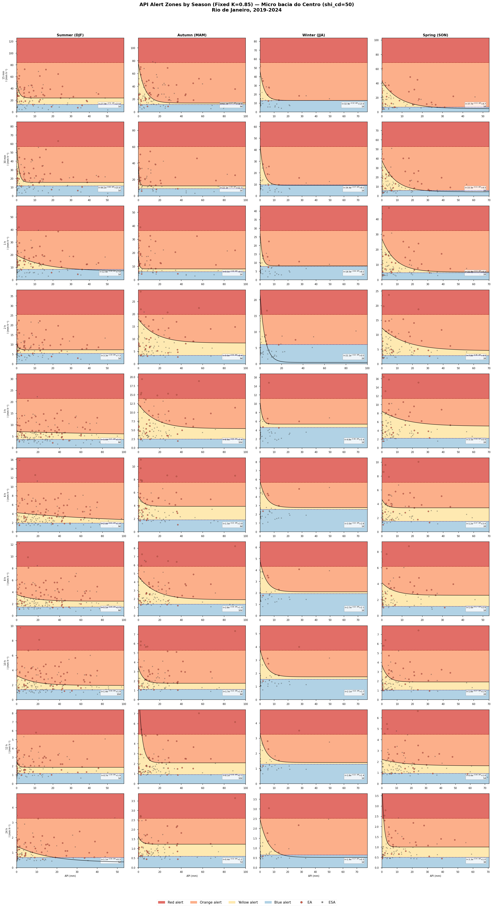

---

#### Canal do Mangue (051) — 2º melhor score

**Visão geral: todos os eventos vs. limiares sazonais:**

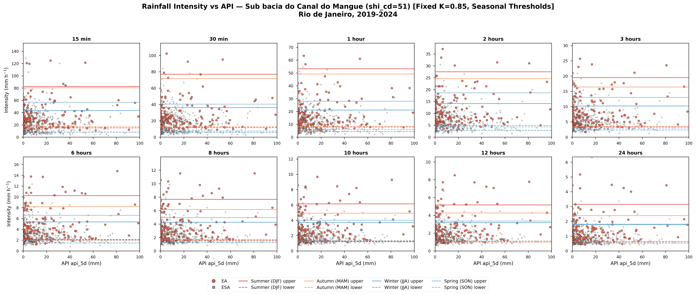

**Limiares I-D por estação:**

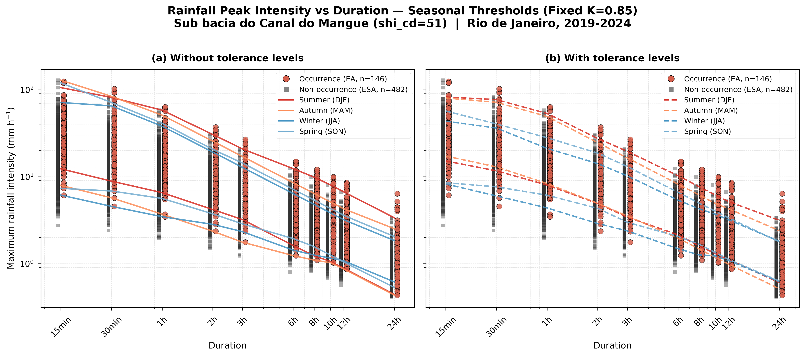

**Limiares I-D detalhados por estação:**


**Zonas de alerta sazonais:**

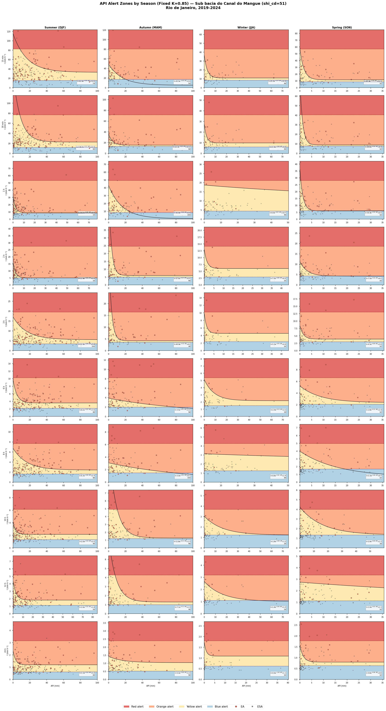

---

#### Canal do Cunha (049) — Maior ganho de FAR no inverno (ΔFAR = −0,458)

**Limiares I-D por estação:**

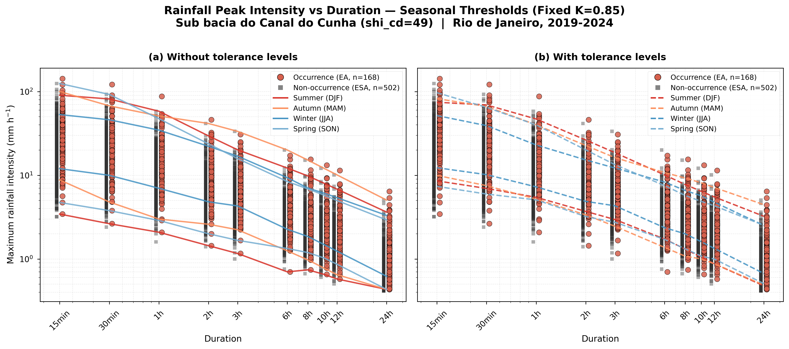

**Limiares I-D detalhados por estação:**

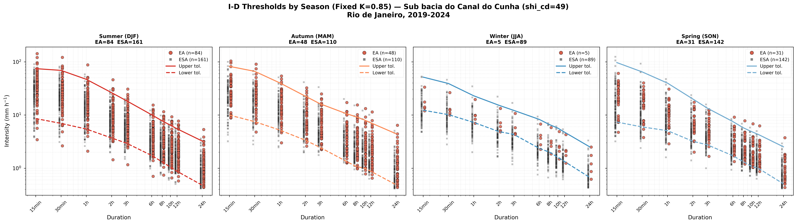

**Zonas de alerta sazonais:**

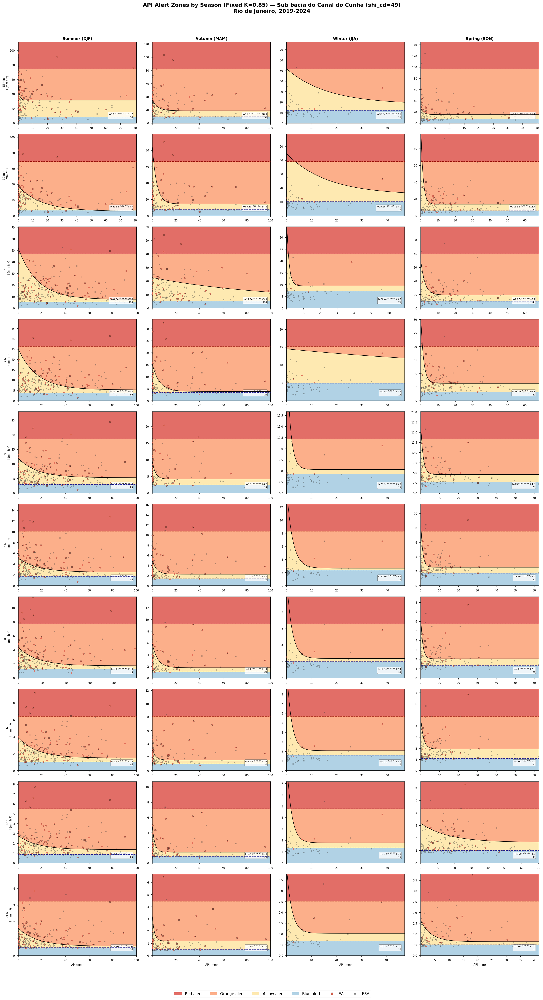

---

## 8. Análise API por Sub-bacia com K Otimizado (Metodologia 6)

### 8.1 Descrição metodológica

A precipitação foi agregada por ponderação da área de interseção entre os Polígonos de Thiessen e as sub-bacias:

```
P_sb = Σ (w_i × P_i)    com  Σw_i = 1
```

Isso gerou **149 pares estação–sub-bacia** distribuídos entre 51 sub-bacias.

**Inovação central:** O coeficiente K foi incorporado como parâmetro de busca, K ∈ {0,60; 0,70; 0,75; 0,80; 0,85; 0,90; 0,95}, ampliando o espaço de busca de 10 para **70 combinações** por sub-bacia × duração.

**Reconstrução da precipitação diária:** Como os valores de API originais foram calculados com K = 0,85 fixo, os totais diários (incluindo dias < 10 mm) foram recuperados pela inversão matemática exata:

```
P(t−i) = (API_i − API_{i−1}) / K^i
```

Isso permitiu recalcular a API com qualquer K sem necessitar dos dados brutos originais.

### 8.2 Distribuição do K ótimo

| K | Ocorrências | % | Interpretação |
|---|-------------|---|---------------|
| **0,60** | **136** | **35,8%** | Drenagem rápida — solo urbano impermeabilizado |
| 0,95 | 81 | 21,3% | Alta retenção — corpos d'água, solo permeável |
| 0,80 | 40 | 10,5% | — |
| 0,85 | 35 | 9,2% | Valor único de estudos anteriores |
| 0,75 | 32 | 8,4% | — |
| 0,70 | 31 | 8,2% | — |
| 0,90 | 25 | 6,6% | — |

> **K = 0,85 é ótimo em apenas 9,2% dos casos.** A distribuição bimodal (pico em 0,60 e 0,95) evidencia dois regimes hidrológicos distintos no município.

### 8.3 Resultados por sub-bacia

| # | Sub-bacia | POD | FAR | PPV | K médio | Dias ant. médio | a médio | b médio |
|---|-----------|-----|-----|-----|---------|----------------|---------|---------|
| 1 | Canal do Mangue (51) | 0,945 | 0,728 | 0,283 | 0,700 | 2,0 | 9,83 | −0,276 |
| 2 | Micro Bacia do Centro (50) | 0,950 | 0,789 | 0,332 | 0,770 | 5,3 | 9,38 | −0,218 |
| 3 | Canal do Cunha (49) | 0,947 | 0,857 | 0,271 | 0,760 | 4,5 | 6,40 | −0,192 |
| 4 | Copacabana (36) | 0,944 | 0,686 | 0,123 | 0,820 | 7,0 | 18,95 | −0,057 |
| 5 | Urca (54) | 0,875 | **0,350** | 0,056 | 0,760 | 1,0 | 44,78 | −0,015 |
| 6 | Rio Sarapuí (47) | 0,947 | 0,560 | 0,070 | 0,690 | 1,8 | 24,60 | −0,609 |
| 7 | Restinga da Barra (37) | 0,950 | 0,902 | 0,288 | 0,760 | 1,0 | 38,57 | −0,651 |
| 8 | Lagoa Rodrigo de Freitas (33) | 0,945 | 0,872 | 0,212 | 0,765 | 1,0 | 11,61 | −0,547 |
| 9 | Acari/Pavuna/Meriti (45) | 0,950 | 0,911 | 0,289 | 0,760 | 7,5 | 5,60 | −0,156 |
| 10 | Arroio Fundo/Rio Grande (26) | 0,941 | 0,839 | 0,162 | 0,800 | 3,8 | 6,81 | −0,390 |
| 11 | Cocotá/Pitangueiras (12) | 0,833 | 0,400 | 0,043 | 0,645 | 1,5 | 11,76 | −0,291 |
| 12 | Rio Carioca (52) | 0,941 | 0,759 | 0,088 | 0,680 | 3,5 | 11,67 | −0,224 |
| 13 | Rio das Pedras (35) | 0,932 | 0,792 | 0,100 | 0,715 | 1,0 | 45,56 | −0,562 |
| 14 | Canal dos Bancários (8) | 0,938 | 0,718 | 0,070 | 0,785 | 5,0 | 45,43 | −0,151 |
| 15 | Rio Ramos (48) | 0,946 | 0,785 | 0,087 | 0,805 | 6,2 | 29,45 | −0,067 |
| 16 | Rio Guerenguê (28) | 0,900 | 0,577 | 0,041 | 0,695 | 1,9 | 34,59 | −0,146 |
| 17 | Prata do Mendanha (18) | 0,947 | 0,749 | 0,052 | 0,840 | 5,5 | 25,34 | −0,166 |
| 18 | Praia de São Bento (14) | 0,952 | 0,841 | 0,081 | 0,760 | 4,8 | 46,67 | −0,641 |
| 19 | Rio Jequiá (13) | 0,921 | 0,855 | 0,088 | 0,845 | 6,7 | 38,24 | −0,135 |
| 20 | Botafogo (53) | 0,941 | 0,910 | 0,133 | 0,765 | 4,5 | 39,50 | −0,354 |
| 21 | Galeão (9) | 0,875 | 0,587 | 0,031 | 0,865 | 5,0 | 32,82 | −0,057 |
| 22 | Rio Irajá/Canal da Penha (46) | 0,943 | 0,860 | 0,069 | 0,745 | 1,8 | 36,10 | −0,099 |
| 23 | Rio da Cachoeira (30) | 0,948 | 0,921 | 0,115 | 0,790 | 1,7 | 35,10 | −0,484 |
| 24 | São Conrado (39) | 0,947 | 0,923 | 0,115 | 0,845 | 7,5 | 38,48 | −0,114 |
| 25 | Rio Piraquê/Cabuçu (21) | 0,952 | 0,805 | 0,044 | 0,830 | 5,9 | 35,81 | −0,067 |
| 26 | Rio do Ponto (22) | 0,917 | 0,846 | 0,055 | 0,900 | 6,4 | 15,63 | −0,062 |
| 27 | Praia da Guanabara (10) | 0,923 | 0,831 | 0,049 | 0,790 | 9,5 | 44,66 | −0,177 |
| 28 | Zona dos Canais (29) | 0,941 | 0,806 | 0,038 | 0,690 | 1,1 | 59,23 | −0,187 |
| 29 | Rio Campinho (19) | 0,933 | 0,903 | 0,061 | 0,825 | 3,9 | 15,82 | −0,067 |
| 30 | Jardim Guanabara (15) | 0,833 | 0,724 | 0,024 | 0,630 | 1,0 | 31,84 | −0,614 |
| 31 | Rio dos Passarinhos (31) | 0,927 | 0,842 | 0,033 | 0,620 | 1,0 | 37,38 | −0,713 |
| 32 | Rio da Barra (41) | 0,750 | 0,626 | 0,017 | 0,740 | 1,8 | 30,78 | −0,344 |
| 33 | Rio do Anil (27) | 0,900 | 0,780 | 0,023 | 0,655 | 1,0 | 31,32 | −0,224 |
| 34 | Vidigal (40) | 0,500 | 0,253 | 0,011 | — | 0 | — | — |
| 35 | Ilha do Fundão (17) | 0,667 | 0,502 | 0,009 | 0,775 | 4,6 | 9,17 | −0,146 |
| 36 | Canal da Portuguesa (11) | 0,857 | 0,851 | 0,024 | 0,830 | 6,5 | 30,37 | −0,333 |
| 37 | Rio Cação Vermelho (20) | 0,927 | 0,942 | 0,052 | 0,875 | 5,4 | 19,37 | −0,344 |
| 38 | Rio Muzema (38) | 0,857 | 0,882 | 0,024 | 0,675 | 1,6 | 21,99 | −0,630 |
| 39 | Rio Camorim/Caçambê (32) | 0,667 | 0,755 | 0,007 | 0,650 | 1,0 | 27,19 | −0,203 |
| **Média** | — | **0,895** | **0,757** | — | — | — | — | — |

#### Interpretação dos parâmetros da curva I = a·e^(b·API) + c

| Parâmetro | Significado | Faixa observada |
|-----------|-------------|----------------|
| **a** | Amplitude — intensidade de referência quando API = 0 | 5,60 (Acari) a 59,23 (Zona dos Canais) |
| **b** | Sensibilidade à API — quanto mais negativo, mais o limiar cai com a saturação | −0,015 (Urca) a −0,713 (Rio dos Passarinhos) |
| **c** | Deslocamento vertical — limiar mínimo independente da API | 0,83 (Passarinhos) a 14,81 (Cocotá) |

> Sub-bacias com **b próximo de zero** (Urca, b = −0,015; Galeão, b = −0,057) têm limiares quase insensíveis à API — a chuva do evento em si é o único determinante. Sub-bacias com **b muito negativo** (Passarinhos, b = −0,713; Sarapuí, b = −0,609) têm limiares fortemente modulados pelo estado de saturação prévio.

### 8.4 Gráficos — Canal do Mangue (maior melhoria com K otimizado: +0,083)

**Zonas de alerta com K = 0,85 (versão original):**


**Limiares I-D com K = 0,85 (versão original):**


**Zonas de alerta com K otimizado (versão melhorada):**

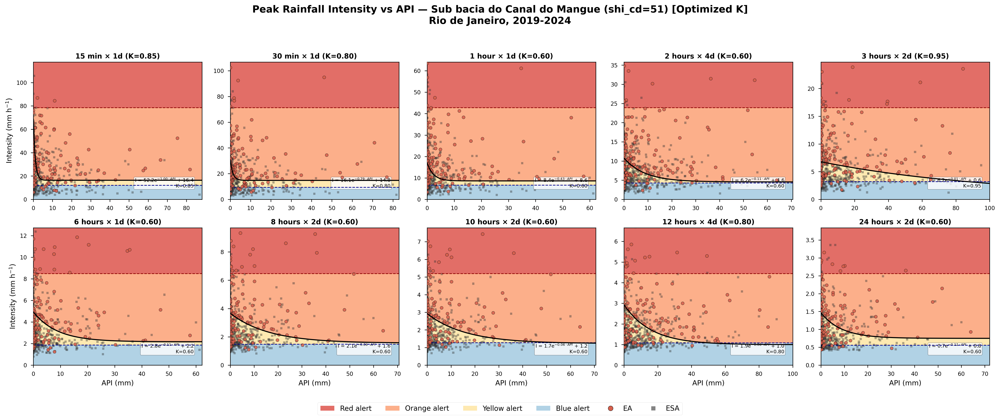

**Limiares I-D com K otimizado (versão melhorada):**

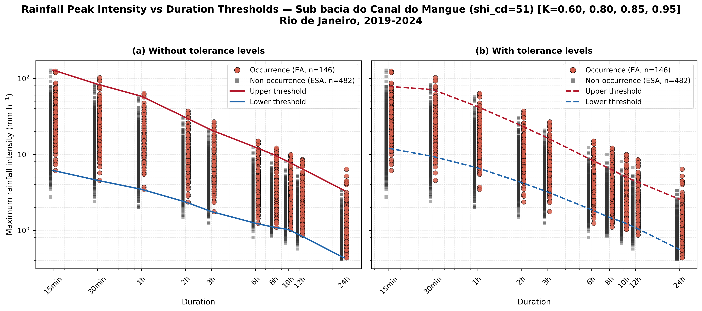

### 8.5 Gráficos — Micro Bacia do Centro (maior score absoluto)

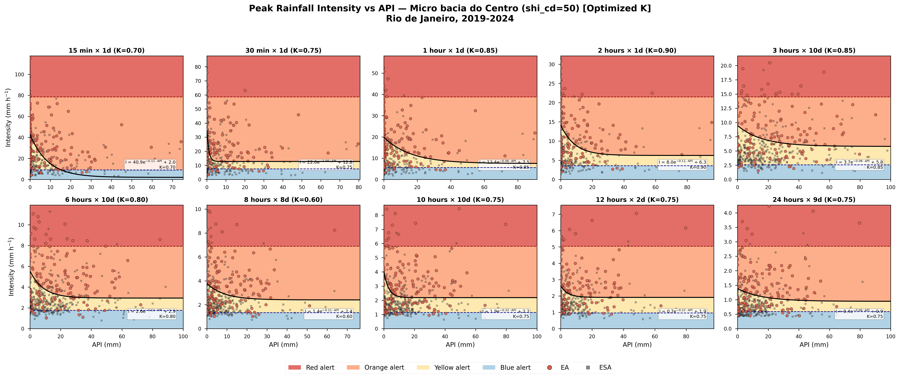

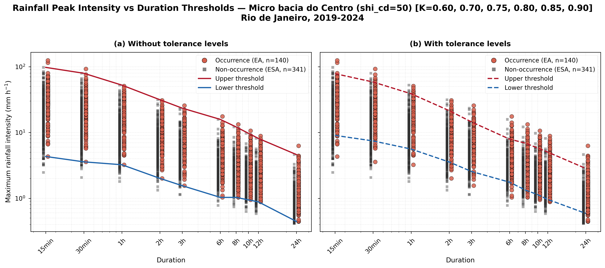

### 8.6 Gráficos — Sub-bacia com menor FAR: Micro Bacia da Urca (FAR = 0,350)

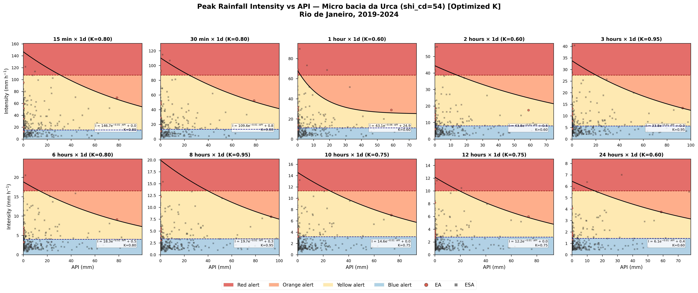

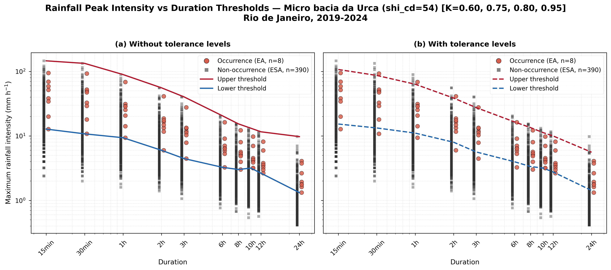

---

## 9. Análise Sazonal com K Otimizado (Metodologia 7)

### 9.1 Descrição metodológica

A mesma busca em grade (7 K × 10 janelas) foi aplicada separadamente para as quatro estações meteorológicas do hemisfério Sul:

| Estação | Meses | EA | % |
|---------|-------|-----|---|
| Verão (DJF) | dez, jan, fev | 802 | 47,0% |
| Outono (MAM) | mar, abr, mai | 521 | 30,5% |
| Primavera (SON) | set, out, nov | 279 | 16,4% |
| Inverno (JJA) | jun, jul, ago | 104 | 6,1% |

**Critério mínimo:** ≥ 3 EA e ≥ 3 ESA por estação. Sub-bacias abaixo do mínimo usam o limiar anual como fallback.

### 9.2 Desempenho por estação

| Estação | n ajustados | POD | FAR | PPV | Score | K médio | Dias ant. médio | FAR < 0,60 |
|---------|------------|-----|-----|-----|-------|---------|----------------|-----------|
| Verão (DJF) | 350 | 0,880 | 0,748 | 0,137 | 0,030 | 0,733 | 3,9 dias | 17% |
| Outono (MAM) | 300 | 0,863 | 0,763 | 0,146 | 0,030 | 0,748 | 4,3 dias | 20% |
| **Inverno (JJA)** | **130** | **0,812** | **0,658** | **0,122** | **0,034** | **0,657** | **1,7 dias** | **43%** |
| Primavera (SON) | 220 | 0,822 | 0,745 | 0,099 | 0,021 | 0,706 | 2,2 dias | 18% |
| **Anual (ref.)** | **390** | **0,895** | **0,757** | — | — | — | — | **11%** |

> **Principal resultado:** FAR do inverno = 0,658 vs. 0,757 anual (−10 p.p.). 43% dos casos de inverno têm FAR < 0,60 contra apenas 11% no ajuste anual. O Score do inverno (0,034) é o melhor entre as estações apesar do menor POD.

### 9.3 Limiares lower_tol por estação e duração (mm/h)

| Duração | Verão | Outono | Inverno | Primavera | Δ Verão−Inverno |
|---------|-------|--------|---------|-----------|----------------|
| 15 min | 13,97 | 11,91 | 9,44 | 7,46 | +4,53 (+48%) |
| 30 min | 11,27 | 9,14 | 7,35 | 6,22 | +3,92 (+53%) |
| 1 h | 7,72 | 6,36 | 5,42 | 4,96 | +2,30 (+42%) |
| 2 h | 4,91 | 4,19 | 3,60 | 3,54 | +1,31 (+36%) |
| 3 h | 3,70 | 3,20 | 2,92 | 2,73 | +0,78 (+27%) |
| 6 h | 2,15 | 1,94 | 1,76 | 1,77 | +0,38 (+22%) |
| 24 h | 0,63 | 0,64 | 0,59 | 0,55 | +0,08 (+13%) |

> O verão exige **48% mais intensidade** em 15 min do que o inverno para disparar o mesmo nível de alerta.

### 9.4 Distribuição de K por estação

| K | Verão | Outono | Inverno | Primavera |
|---|-------|--------|---------|-----------|
| **0,60** | 44% | 37% | **75%** | 56% |
| 0,70–0,80 | 24% | 26% | 16% | 22% |
| 0,85–0,95 | 31% | 37% | **9%** | 22% |

> No inverno, **75% dos casos preferem K = 0,60** (memória hídrica quase nula). No verão e outono, K alto aparece em 30–37% dos casos — o histórico de dias chuvosos recentes importa mais.

### 9.5 Maiores ganhos de FAR no inverno vs. anual

| Sub-bacia | FAR anual | FAR inverno | ΔFAR | ΔPOD |
|-----------|-----------|-------------|------|------|
| Canal do Cunha (49) | 0,857 | 0,399 | **−0,458** | −0,147 |
| Micro Bacia do Centro (50) | 0,789 | 0,359 | **−0,430** | −0,093 |
| Acari/Pavuna/Meriti (45) | 0,911 | 0,550 | **−0,360** | −0,150 |
| Arroio Fundo/Rio Grande (26) | 0,839 | 0,559 | −0,281 | −0,274 |
| Rio Ramos (48) | 0,785 | 0,508 | −0,277 | −0,279 |
| Rio das Pedras (35) | 0,792 | 0,593 | −0,198 | −0,098 |
| Botafogo (53) | 0,910 | 0,770 | −0,139 | −0,141 |

### 9.6 Cobertura no inverno

**38 das 51 sub-bacias** não possuem o mínimo de 3 EA no inverno — para estas, o limiar anual é o fallback operacional.

### 9.7 Gráficos sazonais

**Resumo geral — métricas, limiares e K por estação:**

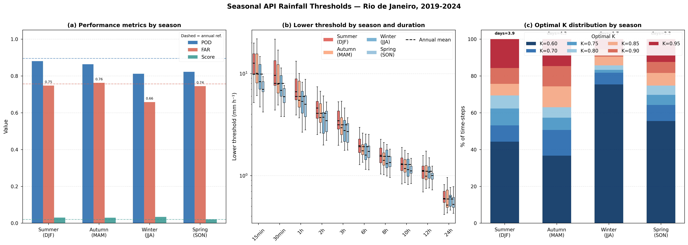

**Limiares I-D sazonais — Canal do Mangue (4 painéis):**

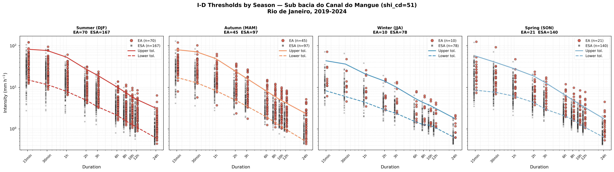

**Limiares I-D sazonais — Micro Bacia do Centro:**

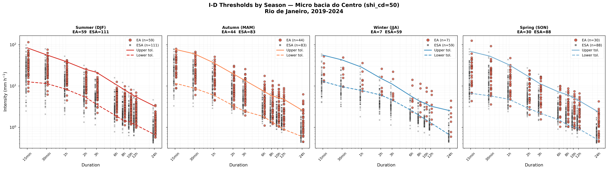

**Limiares I-D sazonais — Canal do Cunha (maior ganho de FAR no inverno):**

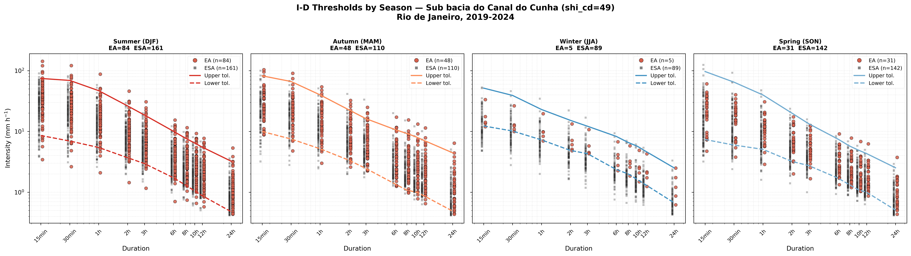

**Zonas de alerta sazonais — Canal do Mangue (grade 10 durações × 4 estações):**

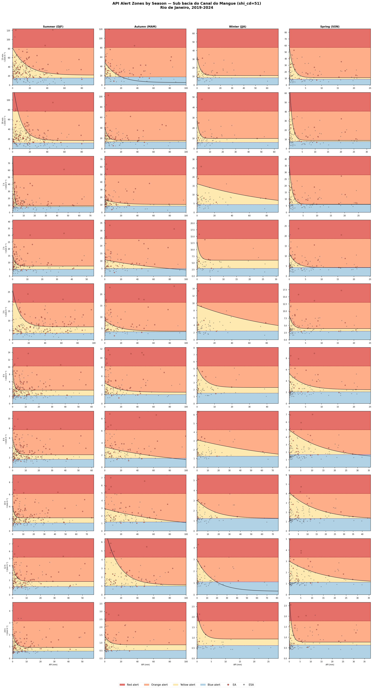

**Zonas de alerta sazonais — Sub-bacia dos Rios Acari/Pavuna/Meriti:**

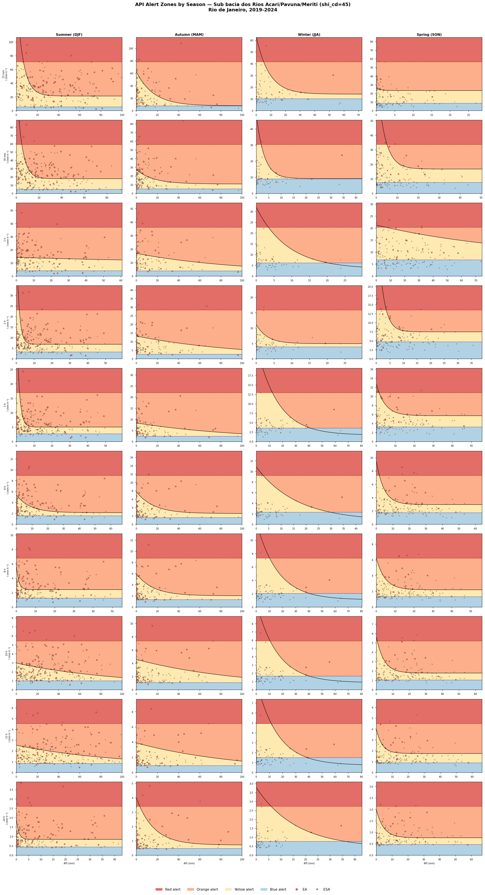

---

## 10. Comparação entre Metodologias

### 10.1 Evolução das métricas

| # | Metodologia | Escala | POD | FAR | Score médio | Cobertura | Parâmetros |
|---|-------------|--------|-----|-----|------------|-----------|-----------|
| 1 | I-D SVM | Estação | 0,935 | — | F1 = 0,174 | 9/33 est. | 2 (a, b) |
| 2 | API global K fixo | Cidade | 0,946 | 0,739 | — | 10 time-steps | 5 (a,b,c,janela,K=0,85) |
| 3 | API por estação K fixo | Estação | 0,794 | 0,596 | — | 22/33 est. | 5 por time-step |
| 4 | API sub-bacia K fixo | Sub-bacia | 0,895 | 0,757 | 0,0205 | 39/51 sub-b. | 5 (a,b,c,janela,tol.) |
| 5 | API sazonal K fixo | Sub-b. × estação | 0,844 | 0,728 | — | 1.000/2.040 | 5 por estação |
| 6 | API sub-bacia K otimizado | Sub-bacia | 0,895 | 0,757 | 0,0208 | 39/51 sub-b. | 6 (+K por sub-bacia) |
| 7 | API sazonal K otimizado | Sub-b. × estação | 0,844 | 0,728 | — | 1.000/2.040 | 6 por estação |

### 10.2 Ganho incremental de cada metodologia

| Avanço | Ganho principal | Custo |
|--------|----------------|-------|
| 1→2 I-D → API global | Zona intermediária com FAR_api < 0,15 | Série histórica diária |
| 2→3 Global → Por estação | FAR cai de 0,739 para 0,596 | Menos cobertura (22 vs. 33 est.) |
| 3→4 Estação → Sub-bacia K fixo | Escala hidrológica correta; POD sobe de 0,794 para 0,895 | Pesos Thiessen; agregação |
| 4→5 Anual K fixo → Sazonal K fixo | FAR inverno: 0,757 → 0,658 (−10 p.p.) | 38/51 sub-bacias sem dados no inverno |
| 4→6 K fixo → K otimizado (anual) | Curva intermediária mais precisa fisicamente; +0,083 no Canal do Mangue | 7× mais combinações; reconstrução da série diária |
| 5→7 Sazonal K fixo → Sazonal K otimizado | Parâmetros da curva mais ajustados (b mais negativo no inverno); ganho operacional marginal | Grid search de K por estação |

### 10.3 Relação entre K fixo e K otimizado nas análises sazonais

Os limiares de decisão (lower_tol, upper_tol, POD e FAR) são **idênticos** entre as metodologias 5 e 7. A diferença está exclusivamente nos parâmetros da curva exponencial intermediária:

| Estação | b médio K fixo | b médio K otim. | Δb | FAR_api K fixo | FAR_api K otim. |
|---------|---------------|----------------|-----|---------------|----------------|
| Verão | −0,249 | −0,288 | −0,039 | 0,165 | 0,157 |
| Outono | −0,265 | −0,272 | −0,007 | 0,131 | 0,132 |
| Inverno | −0,307 | −0,365 | −0,058 | 0,087 | 0,086 |
| Primavera | −0,367 | −0,419 | −0,052 | 0,128 | 0,126 |

> O K otimizado produz curvas ligeiramente mais sensíveis à API (b mais negativo) sem alterar os limiares de alerta. Para uso operacional com alertas baseados em lower_tol/upper_tol, as duas versões são equivalentes.

### 10.4 Distribuição de FAR por metodologia

| Faixa de FAR | API global | Sub-bacia K fixo | Sazonal inverno (ambos) |
|-------------|-----------|-----------------|------------------------|
| < 0,50 | 10% | 10% | **29%** |
| < 0,60 | 10% | 14% | **43%** |
| ≥ 0,80 | 50% | 45% | **32%** |

### 10.5 Característica estrutural dos resultados

O alto POD (0,89–0,95) e o alto FAR (0,73–0,76) são esperados e derivam do **desbalanceamento severo** entre classes:
- EA: 1.706 dias (7,2% do total)
- ESA: 20.093 dias (92,8% do total)

Para cada dia com alagamento há ~12 dias sem alagamento. Um limiar conservador (que não perde eventos) inevitavelmente alarma em uma fração elevada dos dias chuvosos sem alagamento. Isso é operacionalmente aceitável para alertas preventivos, onde o custo de perder um evento é muito maior do que o custo de um falso alarme.

---

## 11. Inventário de Gráficos e Arquivos

### 11.1 Gráficos gerados (646 imagens)

| Pasta | Imagens | Descrição |
|-------|---------|-----------|
| `chart_01` até `chart_10` | 14 | Caracterização geral dos dados |
| `chart_11_id_by_station/` | 33 | Scatter I-D EA/ESA por estação |
| `chart_12_id_thresholds/` | 33 | Curvas I = a×D⁻ᵇ por estação |
| `chart_13_api_id_thresholds/` | 1 | Limiares API global com tolerância |
| `chart_14_api_alert_zones/` | 1 | Zonas de alerta API global |
| `chart_15_api_alert_zones_per_station/` | 33 | Zonas de alerta por estação |
| `chart_16_api_id_thresholds_per_station/` | 33 | Limiares I-D API por estação |
| `chart_17_api_alert_zones_per_subbacia/` | 51 | Zonas de alerta por sub-bacia (K=0,85) |
| `chart_18_api_id_thresholds_per_subbacia/` | 51 | Limiares I-D por sub-bacia (K=0,85) |
| `chart_19_api_alert_zones_per_subbacia_v2/` | 51 | Zonas de alerta com K otimizado |
| `chart_20_api_id_thresholds_per_subbacia_v2/` | 51 | Limiares I-D com K otimizado |
| `chart_21_seasonal_thresholds/` | 1 | Resumo sazonal K otimizado (3 painéis) |
| `chart_22_seasonal_id_thresholds/` | 51 | Limiares I-D sazonais K otimizado por sub-bacia |
| `chart_23_seasonal_alert_zones/` | 51 | Zonas de alerta sazonais K otimizado (10 × 4) |
| `chart_24_api_alert_zones_per_subbacia_fixed_k/` | 51 | Zonas de alerta anual K fixo por sub-bacia |
| `chart_25_api_id_thresholds_per_subbacia_fixed_k/` | 51 | Limiares I-D anual K fixo por sub-bacia |
| `chart_26_seasonal_thresholds_fixed_k/` | 1 | Resumo sazonal K fixo (3 painéis) |
| `chart_27_seasonal_id_thresholds_fixed_k/` | 51 | Limiares I-D sazonais K fixo por sub-bacia |
| `chart_28_seasonal_alert_zones_fixed_k/` | 51 | Zonas de alerta sazonais K fixo (10 × 4) |

### 11.2 Dados processados

| Arquivo | Linhas | Descrição |
|---------|--------|-----------|
| `id_analysis/pontos_id_df.csv` | 63.776 | Todos os pontos I-D com classificação |
| `id_analysis/threshold_parameters.csv` | 9 | Parâmetros SVM por estação |
| `api_analysis/api_analysis_events.csv` | 4.421 | Intensidades diárias + API por estação |
| `api_analysis/api_threshold_parameters.csv` | 10 | Limiares globais por time-step |
| `api_analysis/api_threshold_parameters_per_station.csv` | 330 | Limiares por estação × time-step |
| `api_analysis_subbacia/api_analysis_events_subbacia.csv` | 21.800 | Intensidades + API por sub-bacia |
| `api_analysis_subbacia/subbacia_daily_composite_reconstructed.csv` | 105.043 | Precipitação diária reconstruída |
| `api_analysis_subbacia/api_threshold_parameters_per_subbacia.csv` | 511 | Limiares com K otimizado |
| `api_analysis_subbacia/api_threshold_parameters_seasonal.csv` | 2.040 | Limiares sazonais K otimizado |
| `api_analysis_subbacia/api_threshold_metrics_seasonal.csv` | 69.580 | Métricas detalhadas sazonais K otimizado |
| `api_analysis_subbacia/api_threshold_parameters_seasonal_fixed_k.csv` | 2.040 | Limiares sazonais K fixo (0,85) |
| `api_analysis_subbacia/api_threshold_metrics_seasonal_fixed_k.csv` | 9.940 | Métricas detalhadas sazonais K fixo |

### 11.3 Scripts principais

| Script | Função |
|--------|--------|
| `process_id_analysis.py` | Segmentação de eventos e classificação I-D |
| `fit_id_thresholds.py` | Ajuste SVM por estação |
| `process_api_analysis.py` | Intensidades diárias + API por estação |
| `fit_api_thresholds.py` | Limiares API global (grid search) |
| `fit_api_thresholds_per_station.py` | Limiares API por estação |
| `process_api_analysis_subbacia.py` | Agregação por sub-bacia + API |
| `fit_api_thresholds_per_subbacia.py` | Limiares com K otimizado (70 combinações) |
| `fit_api_thresholds_per_subbacia_seasonal.py` | Limiares sazonais K otimizado (4 estações × 70 combinações) |
| `fit_api_thresholds_per_subbacia_seasonal_fixed_k.py` | Limiares sazonais K fixo 0,85 (grid search n_days=1–10 apenas) |

---

*Relatório gerado automaticamente a partir dos resultados do projeto rain-and-flood-analysis.*  
*Hanna Soares Viana — PPGM IGEO-UFRJ — 2026*
